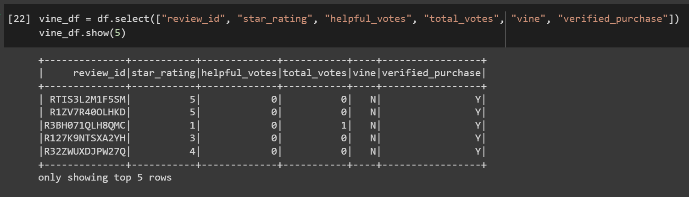

# Amazon_Vine_Analysis

# Resources
*   Data Source: 
    *   Amazon Reviews: US Video Games [(S3 Zip File Link)](https://s3.amazonaws.com/amazon-reviews-pds/tsv/amazon_reviews_us_Video_Games_v1_00.tsv.gz)
*   Software: 
    *   PySpark 3.2.1
    *   Amazon Web Services (AWS), Relational Database Service (RDS)
    *   Google CoLab
    *   pgAdmin 4
*   Provided Starter Codes:
    *   [Amazon_Reviews_ETL_starter_code.ipynb](https://github.com/KevinDBrian/Amazon_Vine_Analysis/blob/main/resources/Amazon_Reviews_ETL_starter_code.ipynb)
    *   [challenge_schema.sql](https://github.com/KevinDBrian/Amazon_Vine_Analysis/blob/main/resources/challenge_schema.sql)

## Overview
Within this challenge I was tasked with performing ETL on a list of Amazon PRoduct Reviews and determining if there seemed to be an apparent bias when comparing paid and unpaid reviews (Vine: Y/N in the DataFrame). The challenge required me to use AWS RDS to create a database and pgAdmin, using the provided `challenge_schema.sql`, to generate tables within said database.

After formatting the database, I needed to use Google CoLab to perform ETL on the Amazon Review dataset and upload it to the database. Using PySpark I was able to import and use functions like `.addFile(URL)`, `.grouby()` and `.select()` to extract and transform the data to fit into the provided schema and then load the data into the database.

After confirming the load was completely successfully. I began the task of checking for bias in the review process by comparing the number of five star reviews between paid and unpaid reviewers. I accomplished this by once again extracting the data and creating a DataFrame with the relevant info. From there I was able to use functions like `.filter()` and `.count()` to gather the variables need to calculate some simple statistics to check for the simple biases. 

## Results
### Amazon Reviews ETL
Below are the images the show that the dataset was properly transformed and loaded into the database.

#### Review ID Table

#### Products Table

#### Customers Table

#### Vine Table

### Vine Review Analysis
These images show the results of my analysis for bias within the review process.

#### Vine Table Recreated
To properly filter and analize the needed info, I needed to recreate the Vine Table from the ETL process.

#### DataFrames for Filtering Info
Separate DataFrames were created for each set of the bias analysis. 
My filtering generated DataFrames with the following information:
*   Reviews with at least twenty or more total votes
*   Reviews where the number of helpful votes were at least half or more of the total votes
*   Confirmed Vine program (paid) reviews
*   Confirmed non-Vine program (unpaid) reviews

This image displays all these DataFrames and their first five rows.

#### Analysis Calculations
Using the newly created DataFrames, I was able to perform some basic statistical calculations to see if there was a noticeable difference between the paid and unpaid reviews. The following image shows all the calculations and their outcomes.

Note: These are not complete totals, the reviews described below had at least 20 or more total votes and of those votes half were considered helpful. This was shown in the previous filtering process!

The first thing I did was count the number of paid reviews, of where there were 94. Of those paid reviews, 48 of them had a five star rating. Meaning that of all the reviews that were paid, more than half of them were a perfect five stars. The specific percentage is **51.1%**. Lets compare that to the unpaid reviews. In total, there were almost 40,500 unpaid reviews! A substantially larger sample! And of those just over 15,600 were five star reviews. The percentage of five star unpaid reviews was **38.7%**.

## Summary
The numbers in this situation would support the idea of positivity bias for individuals being paid to review a product. Since they are being compensated for their time, this likely leaves the reviewer feeling overall better with the product resulting in a higher star rating. Conversely, unpaid reviewer a more likely to give their unbiased and honest opinion of a product resulting in a more realistic/non-inflated star rating.

An interesting additional study would be to include four star ratings in the filters and calculations. Since a four star rating is still considered an overall positive review, I would be curious to how looking at "five star reviews" would change when looking at "overall positive (four and five star)" reviews. Based on these findings I would think that the number of paid positive reviews would be very high!

I also think it would be a good idea to look at more paid reviews beyond what we filtered for. This dataset, includes a very limited number of 94 paid five star reviews. Expanding our criteria when filtering would increase our sample size of paid reviewers and give a more accurate indication of bias.  
